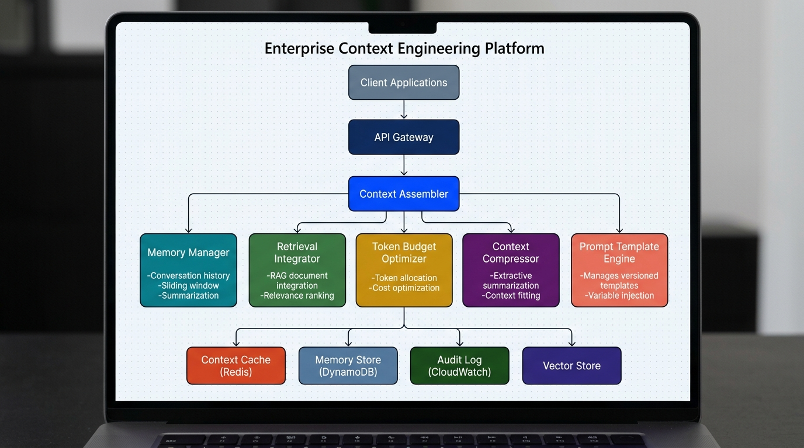

<div align="center">


<h1>Context Engineering</h1>

<p><strong>Enterprise Context Engineering Platform — Context Window Assembly, Memory Management, Token Budget Optimization & Prompt Template Engine</strong></p>

[](https://devopstrio.co.uk)
[](https://python.org)
[](https://devopstrio.co.uk)
[](https://opentofu.org)

</div>

---

## Executive Summary

**Context Engineering** is the specialized platform layer that manages how context windows are assembled, optimized, compressed, cached, and delivered to LLM inference endpoints. It sits between application logic and LLM providers, ensuring every inference call receives a maximally effective context window within the model's token limits.

This platform solves critical enterprise challenges:

| Challenge | Solution |
|-----------|----------|
| **Token budget waste** | Proportional budget allocation across system prompts, memory, RAG documents, and user input |
| **Context window overflow** | Extractive compression that preserves semantic density while reducing token count |
| **Memory management at scale** | Sliding window conversation memory with token-bounded retrieval per session |
| **RAG document ranking** | Relevance-scored document selection with deduplication and budget-aware truncation |
| **Prompt consistency** | Versioned prompt templates with variable injection and audit trails |
| **Repeated context assembly** | TTL-based context caching with LRU eviction for high-throughput workloads |
| **Compliance & observability** | Structured audit logging of every assembly decision for regulatory review |

<div align="center">

</div>

---

## Architecture Details

```
┌─────────────────────────────────────────────────────────────────────────┐
│                        Client Applications                              │
│              (Chat UI · Agent Orchestrator · Batch Inference)            │
└─────────────────────────┬───────────────────────────────────────────────┘
                          │ POST /api/v1/context/assemble
                          ▼
┌─────────────────────────────────────────────────────────────────────────┐
│                      API Gateway (FastAPI)                               │
│                  Health · Assembly · Memory · Templates                   │
└─────────────────────────┬───────────────────────────────────────────────┘
                          │
          ┌───────────────┼───────────────┐
          ▼               ▼               ▼
┌─────────────┐  ┌────────────────┐  ┌──────────────┐
│   Context   │  │    Context     │  │   Prompt     │
│   Cache     │  │   Assembler    │  │  Template    │
│  (Redis)    │  │  (Orchestrator)│  │   Engine     │
└──────┬──────┘  └───────┬────────┘  └──────────────┘
       │                 │
       │     ┌───────────┼───────────┬──────────────┐
       │     ▼           ▼           ▼              ▼
       │ ┌────────┐ ┌──────────┐ ┌──────────┐ ┌──────────┐
       │ │ Token  │ │ Memory   │ │Retrieval │ │ Context  │
       │ │ Budget │ │ Manager  │ │Integrator│ │Compressor│
       │ │Optimizer│ │(DynamoDB)│ │  (RAG)   │ │          │
       │ └────────┘ └──────────┘ └──────────┘ └──────────┘
       │                                          │
       └──────────────────────────────────────────┘
                          │
                          ▼
              ┌───────────────────────┐
              │  Context Audit Logger │
              │    (CloudWatch)       │
              └───────────────────────┘
```

---

## Core Components

### Context Assembler ([`src/context_engineering/assembler/context_assembler.py`](file:///C:/Users/mani/.gemini/antigravity/scratch/enterprise-context-engineering/src/context_engineering/assembler/context_assembler.py))
The orchestration engine that constructs optimized context windows by coordinating all sub-components. Accepts a `ContextAssemblyRequest` containing system prompt, user input, session ID, model configuration, retrieval documents, and tool outputs. Returns a fully assembled context with metadata including token counts, budget allocation, and assembly decisions.

### Memory Manager ([`src/context_engineering/memory/memory_manager.py`](file:///C:/Users/mani/.gemini/antigravity/scratch/enterprise-context-engineering/src/context_engineering/memory/memory_manager.py))
Manages per-session conversation history with sliding window eviction and token-bounded retrieval. Stores conversation turns (role, content, timestamp, token count) and retrieves the most recent turns that fit within the allocated memory token budget.

### Token Budget Optimizer ([`src/context_engineering/budget/token_budget_optimizer.py`](file:///C:/Users/mani/.gemini/antigravity/scratch/enterprise-context-engineering/src/context_engineering/budget/token_budget_optimizer.py))
Allocates the model's context window across competing sections (system prompt, conversation memory, RAG documents, user input) using proportional distribution. Fixed allocations (system prompt, user input) are reserved first, then remaining tokens are distributed between memory and retrieval based on configurable ratios.

### Context Compressor ([`src/context_engineering/compressor/context_compressor.py`](file:///C:/Users/mani/.gemini/antigravity/scratch/enterprise-context-engineering/src/context_engineering/compressor/context_compressor.py))
Implements extractive compression when assembled context exceeds the token budget. Scores sentences by position, length, and keyword density, then selects top-scored sentences until the target token count is reached.

### Prompt Template Engine ([`src/context_engineering/templates/prompt_template_engine.py`](file:///C:/Users/mani/.gemini/antigravity/scratch/enterprise-context-engineering/src/context_engineering/templates/prompt_template_engine.py))
Manages versioned prompt templates with `{{variable_name}}` placeholder syntax. Ships with built-in templates (`default_system`, `rag_augmented`, `conversational`) and supports custom template registration.

### Context Cache ([`src/context_engineering/cache/context_cache.py`](file:///C:/Users/mani/.gemini/antigravity/scratch/enterprise-context-engineering/src/context_engineering/cache/context_cache.py))
TTL-based caching layer for assembled context windows. Generates cache keys from content hashes and serves cached results for repeated or similar queries, reducing latency and compute cost.

### Context Audit Logger ([`src/context_engineering/audit/context_audit_logger.py`](file:///C:/Users/mani/.gemini/antigravity/scratch/enterprise-context-engineering/src/context_engineering/audit/context_audit_logger.py))
Structured JSON logging of all context assembly decisions using `structlog`. Records budget allocations, memory retrievals, compression events, and cache interactions for compliance and debugging.

---

## API Reference

| Method | Endpoint | Description |
|--------|----------|-------------|
| `GET` | `/health` | Service health check (name, version, status, uptime) |
| `POST` | `/api/v1/context/assemble` | Assemble a complete context window from multi-source inputs |
| `POST` | `/api/v1/context/compress` | Compress text to fit within a target token count |
| `GET` | `/api/v1/memory/{session_id}` | Retrieve conversation memory for a session |
| `POST` | `/api/v1/memory/{session_id}` | Store a new conversation turn |
| `DELETE` | `/api/v1/memory/{session_id}` | Clear all memory for a session |
| `POST` | `/api/v1/templates/render` | Render a prompt template with variable substitution |
| `GET` | `/api/v1/templates` | List all registered prompt templates |
| `POST` | `/api/v1/budget/estimate` | Estimate token budget allocation for given inputs |
| `GET` | `/api/v1/audit/events` | Retrieve recent context audit events |

### Example: Assemble Context

```bash
curl -X POST http://localhost:8080/api/v1/context/assemble \
  -H "Content-Type: application/json" \
  -d '{
    "system_prompt": "You are a helpful enterprise assistant.",
    "user_input": "Summarize Q3 revenue trends from the uploaded reports.",
    "session_id": "sess-abc-123",
    "model_name": "gpt-4-turbo",
    "max_tokens": 128000,
    "retrieval_documents": [
      {
        "content": "Q3 revenue reached $4.2B, a 12% increase over Q2...",
        "source": "financial-reports/q3-2024.pdf",
        "relevance_score": 0.94
      }
    ]
  }'
```

### Example: Token Budget Estimation

```bash
curl -X POST http://localhost:8080/api/v1/budget/estimate \
  -H "Content-Type: application/json" \
  -d '{
    "max_tokens": 128000,
    "system_prompt": "You are a helpful assistant.",
    "user_input": "Hello"
  }'
```

---

## Project Structure

```
enterprise-context-engineering/
├── src/context_engineering/       # Python application source
│   ├── api/                       # FastAPI routes and request/response models
│   ├── assembler/                 # Context window assembly orchestration
│   ├── audit/                     # Structured context audit logging
│   ├── budget/                    # Token budget optimization and allocation
│   ├── cache/                     # TTL-based context caching (Redis)
│   ├── compressor/                # Extractive context compression
│   ├── config/                    # Pydantic Settings configuration
│   ├── memory/                    # Conversation memory management
│   ├── retrieval/                 # RAG document ranking and integration
│   ├── templates/                 # Versioned prompt template engine
│   └── main.py                    # FastAPI application entry point
├── tests/                         # Comprehensive test suite
│   ├── unit/                      # Unit tests for each component
│   ├── integration/               # Integration tests for assembly pipeline
│   └── api/                       # API endpoint tests
├── terraform/                     # OpenTofu/Terraform IaC
│   └── modules/                   # DynamoDB, ElastiCache, CloudWatch, VPC
├── deployment/kubernetes/         # Kustomize-based Kubernetes manifests
│   ├── base/                      # Base deployment, service, HPA, PDB, NetworkPolicy
│   └── overlays/                  # Environment-specific patches (dev/staging/prod)
├── .github/workflows/             # CI/CD pipelines (lint, test, security, deploy)
├── docs/                          # Enterprise documentation suite
├── images/                        # Exported architecture diagrams
├── Dockerfile                     # Multi-stage production Docker build
├── docker-compose.yml             # Local development stack
└── pyproject.toml                 # PEP 621 project configuration
```

---

## Quick Start

### Prerequisites

- Python 3.11+
- Docker & Docker Compose (for local development)
- OpenTofu/Terraform >= 1.6 (for infrastructure provisioning)
- kubectl & Kustomize (for Kubernetes deployment)

### Local Development

```bash
# Clone the repository
git clone https://github.com/Devopstrio/enterprise-context-engineering.git
cd enterprise-context-engineering

# Create virtual environment and install dependencies
python -m venv .venv
source .venv/bin/activate  # On Windows: .venv\Scripts\activate
pip install -e ".[dev]"

# Run the development server
uvicorn src.context_engineering.main:app --host 0.0.0.0 --port 8080 --reload

# Run with Docker Compose (includes Redis)
docker-compose up --build
```

### Infrastructure Deployment

```bash
# Initialize and deploy infrastructure
cd terraform
tofu init
tofu plan -var="environment=staging" -out=tfplan
tofu apply tfplan

# Deploy to Kubernetes
cd ../deployment/kubernetes
kubectl apply -k overlays/staging/
```

---

## Configuration

All configuration is managed via environment variables with the `CTX_ENG_` prefix:

| Variable | Default | Description |
|----------|---------|-------------|
| `CTX_ENG_ENVIRONMENT` | `development` | Deployment environment |
| `CTX_ENG_LOG_LEVEL` | `INFO` | Logging level |
| `CTX_ENG_PORT` | `8080` | API server port |
| `CTX_ENG_MAX_CONTEXT_TOKENS` | `128000` | Maximum context window size |
| `CTX_ENG_SYSTEM_PROMPT_BUDGET_PCT` | `0.15` | System prompt token budget percentage |
| `CTX_ENG_MEMORY_BUDGET_PCT` | `0.30` | Conversation memory token budget percentage |
| `CTX_ENG_RETRIEVAL_BUDGET_PCT` | `0.35` | RAG retrieval token budget percentage |
| `CTX_ENG_USER_INPUT_BUDGET_PCT` | `0.20` | User input token budget percentage |
| `CTX_ENG_MEMORY_MAX_TURNS` | `50` | Maximum conversation turns to store |
| `CTX_ENG_COMPRESSION_TARGET_RATIO` | `0.5` | Target compression ratio |
| `CTX_ENG_CACHE_TTL_SECONDS` | `300` | Context cache TTL in seconds |
| `CTX_ENG_REDIS_URL` | `redis://localhost:6379/0` | Redis connection URL |
| `CTX_ENG_ENABLE_AUDIT_LOGGING` | `true` | Enable context audit logging |

---

## Infrastructure

### AWS Resources (OpenTofu)

| Resource | Module | Purpose |
|----------|--------|---------|
| DynamoDB Table | `terraform/modules/context_store` | Conversation memory persistence with TTL and GSI |
| ElastiCache Redis | `terraform/modules/vector_cache` | Sub-millisecond context cache with replication |
| CloudWatch Log Group | `terraform/modules/audit_logs` | Context audit log export with KMS encryption |
| VPC + Subnets | `terraform/modules/network` | Private networking with VPC endpoints |

### Kubernetes Resources

| Resource | Description |
|----------|-------------|
| Deployment | 3 replicas, security-hardened (non-root, read-only rootfs) |
| HPA | Auto-scale 3–20 pods (CPU 70%, Memory 80%) |
| PDB | Minimum 2 pods available during disruptions |
| NetworkPolicy | Ingress restricted to gateway namespace |
| Service | ClusterIP on port 8080 |

---

## Ecosystem Integration

This repository is part of the **Devopstrio Enterprise AI & Multi-Cloud Landing Zone** ecosystem:

| Repository | Integration |
|-----------|-------------|
| [`prompt-router`](https://github.com/Devopstrio/prompt-router) | Routes prompts to this service for context assembly before LLM inference |
| [`gateway-observability`](https://github.com/Devopstrio/gateway-observability) | Collects context assembly metrics and traces |
| [`gateway-security`](https://github.com/Devopstrio/gateway-security) | Enforces authentication and authorization on context assembly endpoints |

<div align="center">

© 2026 Devopstrio — Engineering the Autonomous Enterprise.

</div>
